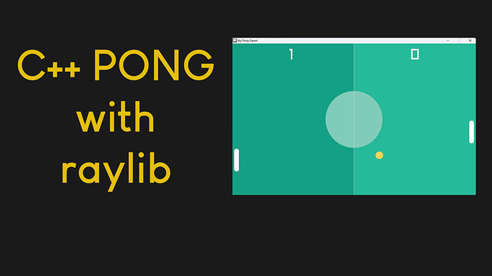

# C++ Juego Retro del Pong usando POO y la libreria grafica "raylib"

Pong Game in C++ using Raylib library.

It works with raylib version 4.5.

Entonces, ¡toma una taza de café y prepárate para sumergirte en el mundo del desarrollo de juegos con RAYLIB!

El temario que he ido haciendo paso a paos es el siguiente:

 1. Creacion de un canvas en blanco y un GameLoop (bucle de juego)
 2. Creando las paletas y la bola
 3. Moviendo la bola
 4. Chequeo de colisiones con los bordes y su cola
 5. Moviendo las paletas del jugador
 6. Mover la paleta de la CPU con algo de IA
 7. Chequear las colisiones con las paletas
 8. Añadiendo titulos, marcos y Marcador de puntos

 Pongo todos las partes del codigo de como ir avanzando en funcion de los logros que vamos realizando en cada paso del indice que hemos creado.

 La versión final del codigo completo, se llama pong.cpp, compilamos y listo !!!

 Disfruta como yo lo he echo mientras codificaba, y jugando a este juego de cuando era joven.

 # Enlaces de Interes

  

 
 

| 📺 <a href="https://nvarona.x10.bz/">My Web Personal Channel</a>
| 🌍 <a href="https://nvarona.x10.bz/blog">My Blog Website</a> | 2024 

